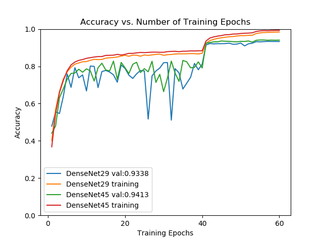

[TOC]

# 经典CNN的复现

包括VGG、BN-VGG、Inception-v1、BN-Inception、Inception-v3、resnet-v1、resnet-v2等等。适用于新手学习入门CNN。

持续更新...

## 在CIFAR10上的正确率

这里我都是最好的结果，同一模型还有更细致的对比实验，详情参见[实验对比](#jump1)。

|    MODEL     | ACCURACY |
| :----------: | :------: |
|    VGG16     |  90.06%  |
|   BN-VGG16   |  92.31%  |
| BN-Inception |  92.41%  |
| Inception-v3 |  92.94%  |
|  ResNet-v1   |  93.54%  |
|  ResNet-v2   |  95.35%  |
|  DenseNet    |  94.13   |

## 实验对比

在__CIFAI10__上的测试结果：

### ResNet：

这里是原论文中描述的实现18,34,50,101,154层resnet-v1的效果，忘记加标记了,左边是18和34层。右边是50,101,154层。层数越多acc越低。

<figure class="half">

</figure>

为了适应CIFAR10的低分辨率，我把第一层的卷积核从7x7改成了3x3,并且保持分辨率，后面遵从原论文的设置。为了对比v1和v2的效果，达到实验中说的v1层数越多效果反而越差的效果，我最高设到了301层，但是没有明显的效果，1000多层的实在是跑不动，302层我在GTX 2080Ti上跑了10个小时。看实验图：

<figure class="half">

</figure>

可以看到随着网络加深，v1版本的正确率基本不变了，但是v2版本的还有微小的提升。而且横向对比，ResNet-v2也更有优势。

### VGG16：

<figure class="half">

</figure>

vgg16_bn初始学习率0.1，vgg初始学习率为0.01

如果vgg初始学习率也为0.1的话，整个网络就发散了，之后也不会再收敛，可以看到BN版的vgg对步长不是那么敏感，而且效果有明显的提升。而且加了BN层在100个epoch之前是不如原始vgg的，原因应该是步长太大，步长减少10倍之后，效果就超过了原始VGG。

### Inception：

#### BN-Inception:

我都对0.01和0.001的测试率做了测试。但是按照原论文中设置weight-decay=0.00001怎么也到不了90%以上的正确率，所以我设置了weight-decay分别为1e-5(左图)、5e-5(右图)。这个结果比较有意思，左图不同学习率最终结果没什么差别，说明加了BN之后确实对学习率有一定的容忍性。右图的差别就大了，我个人分析应该是BN并不具备正则的作用，所以还是得到额外的正则项来防止过拟合，但是这次学习率的影响又比较大了，这我还不知道怎么解释，我猜想是因为学习率太小，被正则项限制之后欠拟合了，但是这还需要更多的实验去证明。

<figure class="half">

</figure>

#### Inception-v3

比BN-Inception效果稍好。

#### DenseNet

效果比resNet v1稍好，比resnet v2差一点。而且我加到了85层之后结果不再上升，由于不同层之间feature map的累加，网络层数增加会导致计算量飞速增加。不过可以看到的是DenseNet的收敛速度非常快，应该是梯度传播比较顺利的原因。

